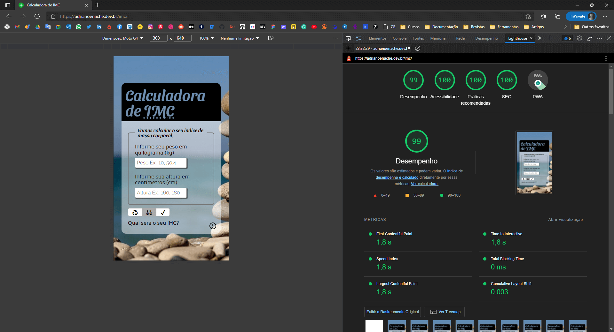
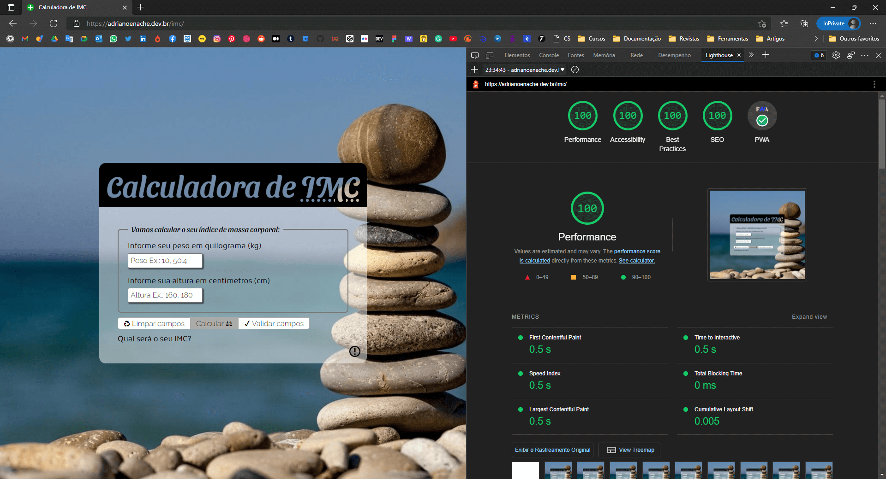

# ReactJS-IMC

[React IMC calculator (My first React app) see it live on this link.](https://adrianoenache.dev.br/imc/)

This project was a introduction for [React framework](https://reactjs.org/) and is my first contact with it. The base idea was given in a [course week](https://www.youtube.com/playlist?list=PLAF5G8rnMmBZQRlBfg6pHIQCXaGcQ8Z2v) that I participated. And I want give congrats the "[SujeitoProgramador](https://sujeitoprogramador.com/)" by give this oportunit to start to use this framework.

The idea is similar, but I changed a lot of things to code, layout and structure folders.

## Lighthouse ressults for mobile and desktop

